# ChaffCTF Writeup

## Intro

ChaffCTF was built around the [ChaffBugs paper](https://arxiv.org/abs/1808.00659) we wrote in 2018.
The basic idea is to add a large number of non-exploitable bugs to a program in order to make it difficult to find any real (exploitable) vulnerabilities.
We created two versions of each challenge, one that had chaff bugs added, and one that had only a single exploitable vulnerability.
Each team got 3 chaff bug challenges and three normal challenges, selected at random.

Unfortunately, some of the programs we used as a base were harder to manually reverse engineer than your average CTF pwn challenge.
Some could be really painful. It's unfortunate that we realized that a little too late after the game
started, but it doesn't mean they are not solvable manually. Hopefully
this writeup can clear up some of the challenge design details.

Our bug construction was similar to what our paper described.
We pick two-byte word as a trigger, and another 4-byte
dword as the crashing value. The "crashing value" will go through some
checkpoints to make it exploitable or not. All the intermediate values are stored as
global variables.

The basic pattern is:

```
    glob_trigger = get_from_input(buf, 2);
    ...
    glob_crash = get_from_input(buf, 4);
    ...
    if (check_upper(glob_crash))
        glob_state |= 1;
    ...
    if (check_lower(glob_crash))
        glob_state |= 2;
    ...
    if (glob_trigger == MAGIC && glob_state == 3)
        profit(glob_crash);  // e.g. ret_address = glob_crash;
```

Our bug injection toolchain can be found over [here](https://github.com/HighW4y2H3ll/chaff/tree/newconstrain).

The three basic kinds of non-exploitable bugs we inject:

* **Overconstrained stack buffer overflow**: this allows stack metadata (frame pointer, return address) to be overwritten, but only with values that are not useful for exploitation.
* **Overconstrained heap buffer overflow**: this allows heap metadata to be overwritten, but again only with values that do not lead to an exploitable vulnerability.
* **Unused stack buffer overflow**: this allows a local variable on the stack to be overwritten, but the variable is not used by the program, so it has no impact. To hide the fact that the variable is unused, we add additional "fake dataflow" to make it look like the program is actually using the variable.

## Challenges

We have 6 different code bases for the challenges.
All of them are stripped 32-bit x86 ELF binaries, compiled with no optimization (-O0).
32-bit binaries are becoming more rare, but unfortunately our current bug injection toolchain doesn't support 64-bit yet.

* `regview`: a windows registry hive parsing program written by @moyix. Source: https://github.com/moyix/regview
* `graphland`: another little program from @moyix that parses a customized file format for directed graphs. Source: https://github.com/moyix/graphland
* `zipread`: zip file parsing program based on [this](https://github.com/kuba--/zip).
* `mp3ninja`: mp3 format codec based on
[minimp3](https://github.com/lieff/minimp3).
* `elfparser`: a tiny ELF format parser [here](https://github.com/TheCodeArtist/elf-parser).
* `dexvm`: a half-baked dalvik virtual machine. Source code is
[here](https://github.com/HighW4y2H3ll/dexvm).

The first 5 programs have both an
unchaffed version (injected with only one exploitable bug) and a
chaffed version (injected with various numbers of chaff bugs and one
exploitable bug). All the exploitable bugs are injected with the same technique as the chaff bugs, but with
loosened constraints that allow exploitable values to be used.

For the `dexvm`, I ran out of good ideas for new constraints, so I dug out one
of my old codebases and turned it into a normal (non-chaff) challenge.

Players can download the challenge binary together with a docker file to setup their local environment for testing and debugging.
When connecting to the challenge service, every player will get a fully functioning shell.
Players are expected to upload their exploits to `/tmp` dir,
run the challenge binary against the uploaded exp and pwn the binary to
read the flag.
The challenge binary was setuid to the pwn user and the flag was made readable only by that user.

## Preparing

We made some nasty patches to the CTFd to give teams different mix of
chaffed and unchaffed challenges.
We also set up challenge services, logs, challenge testing etc. The deploy
script can be found [here](deploy).

Lots of thanks to friends in the [Osiris Lab](https://www.osiris.cyber.nyu.edu/) for helping out and making all this happen.

### regview

100 mixed non-exploitable stack overflow bugs and heap overflow bugs.
A small program, relatively easy to reverse.

#### Constraints

Constraint for the lower half is ANDing with a random word, which is
basically passing for any number.

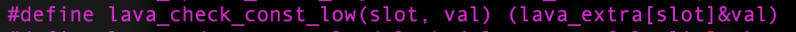

6 non-exploitable constraints for the upper half:

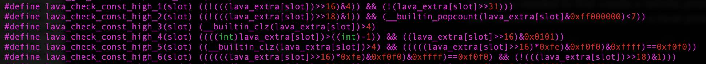

The one exploitable constraint for the upper half:

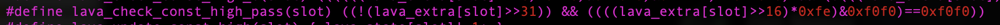

#### Exp

The intended bug is located at `0x08049012` in the unchaffed binary and `0x0804bc78` in the chaffed binary.

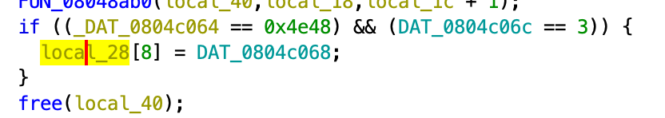

There are `system` symbol in the challenge PLT table, and "/bin/sh"
string in the binary. Find `pop esp; ret` stack pivot and profit.


### graphland

50 mixed non-exploitable stack overflow bugs and heap overflow bugs.
Relatively small program that should be easy to reverse.
It uses function pointers which might be a problem for automated tools.

#### Constraints

Constraint for the lower half is the same, ANDing with a random word.


6 non-exploitable constraints for the upper half: (This is where things
start to get ugly. I used a lot of polynomial math here.)

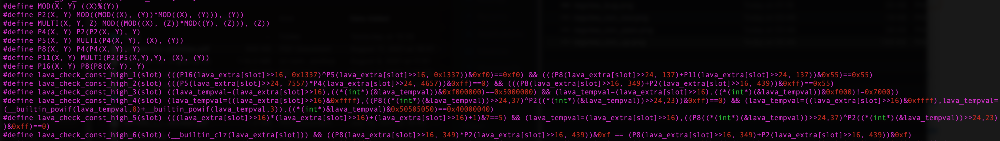

The one exploitable constraint for the upper half:

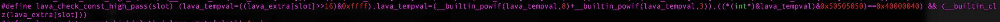

For the unchaffed version of this challenge, the upper half check is changed
to always true.

#### Exp

The intended bug is located at `0x08071573` in the unchaffed binary, `0x08081e97` in the chaffed binary.
4 bytes write to the stack return address.

It's a bit unfortunate if you're a Ghidra user. You might miss the bug
cause Ghidra fails to decompile that line of code. It's gonna help a lot
if you have a licensed IDA pro. But anyhow, in Binary Ninja, it
should look like this:

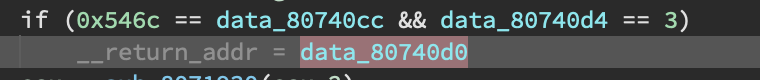

The intended gadget is at `0x08071112` which does `pop esp; sub esp, #0x900;`.
(Searching gadgets with ropper with `esp` should get ~100 gadgets that I
 assume is not too bad...)
That should jump you back to a controlled memory, and then chain the
`system` and "/bin/sh" planted inside the challenge binary.

### zipread

300 mixed non-exploitable stack overflow bugs, heap overflow bugs and
overflow to unused variable.
A bit heavier on reverse engineering.

#### Constraints

Constraint for the lower half is the same, ANDing with a random word.


6 non-exploitable constraints for the upper half: (I used quite a lot very opaque
compiler intrinsics here.)

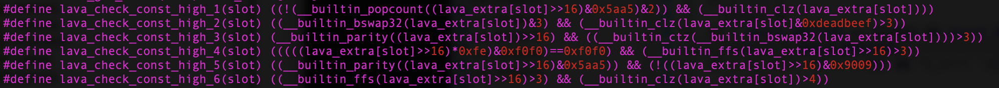

The one exploitable constraint for the upper half:

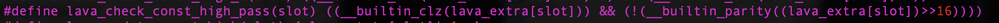

#### Exp

The intended bug is located at `0x08057284` for unchaffed, `0x0805f402` for
chaffed. Controlled 4 bytes write to the stack return address.

Again, if you were using Ghidra, I feel deeply sorry for you. The bug
should look like this in Binary Ninja:

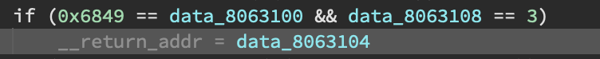

The gadget is actually quite tricky. The intended gadget is
`add esp, 0x10; pop esi; pop esp;` that should be able to pivot your
stack to a controlled memory. The gadget address is `0x08048D51` in
the unchaffed binary and `0x080490d1` in chaffed.


### mp3ninja

350 mixed non-exploitable stack overflow bugs and heap overflow bugs.
Very unfriendly to manually reverse engineering -- a lot of floating
point operations and table lookups. You will definitely
want a licensed IDA Pro if you want to go down on this road.

#### Constraints

Constraint for the lower half is the same, ANDing with a random word.


6 non-exploitable constraints for the upper half:

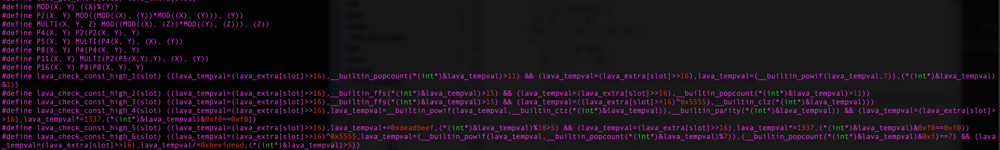

The one exploitable constraint for the upper half:

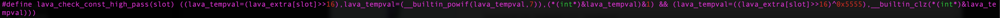

For the unchaffed version of this challenge, the upper half check is changed
to always true.

#### Exp

Again, you'll very likely miss the bug if you use Ghidra. The intended bug is located at `0x0804a726`
in the unchaffed binary, and `0x0804f823` in the chaffed binary.
The bug in Binary Ninja should look like this:

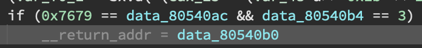

The intended ROP gadget is a very long (20) pop instructions,
starting with a `pop eax; pop esp`, which should get your stack to
controlled memory. Its address is `0x0806b313` in the chaffed binary,
`0x08050823` in the unchaffed.

### elfparser

2000 mixed non-exploitable stack overflow bugs and heap overflow bugs.
The binary itself is actually quite straight forward to reverse
engineer.

At this point I've exhausted all my knowledge of maths and compiler
tricks. The only thing I could think of is to make the ROP gadgets
trickier.

In this challenge, I added a new `.orz` section (of size 0x10000) filled with invalid x86
instructions and forward/backward jumps into each other. All the
constraints ended up in an address inside that section. Among these, there's
only one path, at one specific address, that would lead to a piece of
shellcode, and give you a shell.

#### Constraints

Constrain the upper half to a fixed base:

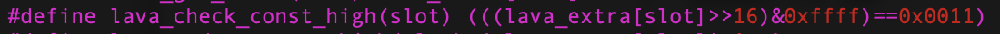

5 non-exploitable constraints for the lower half:


The one exploitable constraint for the lower half:

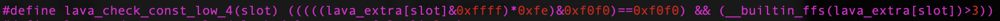

#### Exp

The intended bug is located at `0x0804b584` for unchaffed, `0x08093BC8` for
chaffed. Intended jump address is `0x0011cb88`. And... yes, you will miss
the bug using Ghidra. The bug should look like this in Binary Ninja:

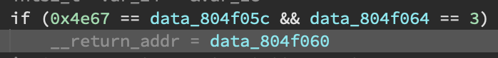

### dexvm

At this point I really ran out of all the good ideas, so this is
basically a shellcoding challenge in case anyone wants to beat the game.

The bug is an out-of-bound read and write when indexing a string object.
The gotcha is the index has to be a string. So your shellcode has to
leak the offset and transform it into a string.

The whole challenge source and solution is hosted
[here](https://github.com/HighW4y2H3ll/dexvm).


## Conclusion

Due to various reasons (e.g., SARS-CoV-2), these challenges have been sitting
in the corner for ~2ys. Very recently, we finally got to dust them off and
release it to the public!  The CTF didn't go as well as we'd
hoped, but still, thanks to everyone for participating in ChaffCTF, and
thanks for all the friends helping out. Hope you all find Chaff Bugs a huge
pain in the ass! :)
