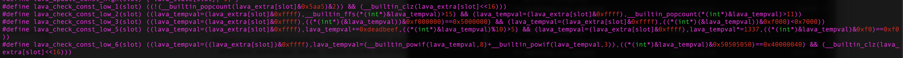

# ChaffCTF writeup

## Intro

ChaffCTF was built around the [ChaffBugs paper](https://arxiv.org/abs/1808.00659) we did ~2018s.
Honestly, most of the challenges are not intended for manual reverse engineering.
Some could be a really pain. It's a bit of unfortunate that we realize that a little late after the game
started, but it doesn't mean they are not solveable manually. Hopefully
this writeup could explain some of the challenge design details.

Our bug construction was similiar to what our paper discribed.
We pick two-byte word as a trigger, and another 4-byte
dword as the crashing value. The "crashing value" will go through some
checkpoints to make sure its exploitable or not. All the intermediate values are stored as
global variables.

```
    glob_trigger = get_from_input(buf, 2);
    ...
    glob_crash = get_from_input(buf, 4);
    ...
    if (check_upper(glob_crash))
        glob_state |= 1;
    ...
    if (check_lower(glob_crash))
        glob_state |= 2;
    ...
    if (glob_trigger == MAGIC && glob_state == 3)
        profit(glob_crash);  // e.g. ret_address = glob_crash;
```

## Challenges

We have 6 different code bases for the challenge.
All of them are stripped 32bit x86
ELF binaries, compiled with no optimization (-O0).

* `regview`: a windows registry hive parsing program written by @moyix.
* `graphland`: another little program from @moyix that parses a customized file format for
graph theories.
* `zipread`: zip file parsing program based on [this](https://github.com/kuba--/zip).
* `mp3ninja`: mp3 format codec based on
[minimp3](https://github.com/lieff/minimp3).
* `elfparser`: ELF format parser [here](https://github.com/TheCodeArtist/elf-parser).
* `dexvm`: a half-baked dalvik virtual machine. Source code is
[here](https://github.com/HighW4y2H3ll/dexvm).

The first 5 of them have both
unchaffed version (injected with only one exploitable bug) and
chaffed version (injected with various numbers of chaff bugs and one
exploitable bug). All the intended bugs are the same chaff bugs with
loosened constrains, so you are able to pass some useful addresses.

For the `dexvm`, I ran out of good ideas for new constrains, so I dug out one
of my old codebase and turned it into a challenge.

When connecting to the challenge service, every player will get a full functioning shell.
Players are expected to upload their exploits to `/tmp` dir,
run the challenge binary against the uploaded exp and pwn the binary to
read the flag.

## Preparing

Made some nasty patches to the CTFd to give teams different mix of
chaffed and unchaffed challenges.
Setting up challenge sevices, logs, challenge testing etc. The deploy
script can be find .

Lots of thanks towards @osiris friends for helping out and making all this happen.

### regview

100 mixed non-exploitable stack overflow bugs and heap overflow bugs.
A small program relatively easy to reverse.

#### Constrain

Constrain for the lower half is And'ing with a random word, which is
basically passing for any number.


6 non-exploitable constrains for the upper half:


The one exploitable constrain for the upper half:


#### Exp

The intended bug locates at `0x08049012` in unchaffed binary and `0x0804bc78` in chaffed binary.


There are `system` symbol in the challenge PLT table, and "/bin/sh"
string in the binary. Find `pop esp; ret` stack pivot and profit.


### graphland

50 mixed non-exploitable stack overflow bugs and heap overflow bugs.
Relatively small program should be easy to reverse.
Have function pointers which might be a problem for automated tools.

#### Constrain

Constrain for the lower half is the same, And'ing with a random word.


6 non-exploitable constrains for the upper half: (This is where things
starting to get ugly. I used a lot of polynomial math here.)


The one exploitable constrain for the upper half:


For unchaffed version of this challenge, the upper half check is changed
to always true.

#### Exp

The intended bug locates at `0x08071573` in unchaffed binary, `0x08081e97` in chaffed binary.
4 bytes write to the stack return address.

It's a bit unfortunate if you're a Ghidra user. You might miss the bug
cause Ghidra fails to decompile that line of code. It's gonna help a lot
if you have a licensed IDA pro. But anyhow, in Binary Ninja, it
should look like this:


The intended gadget is at `0x08071112` which does `pop esp; sub esp, #0x900;`.
(Searching gadges with ropper with `esp` should get ~100 gadgets that I
 assume its not too bad...)
That should jump you back to a controlled memory, and then chain the
`system` and "/bin/sh" planted inside the challenge binary.


### zipread

300 mixed non-exploitable stack overflow bugs, heap overflow bugs and
overflow to unused variable.
A bit heavier on reverse engineering.

#### Constrains

Constrain for the lower half is the same, And'ing with a random word.


6 non-exploitable constrains for the upper half: (I used quite a lot very opaque
compiler intrinics here.)


The one exploitable constrain for the upper half:


#### Exp

The intended bug locates at `0x08057284` for unchaffed, `0x0805f402` for
chaffed. Controlled 4 bytes write to the stack return address.

Again, if you were using Ghidra, I feel deeply sorry for you. The bug
should looks like this in Binary Ninja:


The gadget is actually quite tricky. The intended gadget is
`add esp, 0x10; pop esi; pop esp;` that should be able to pivot your
stack to a controlled memory. The gadget address is `0x08048D51` in
unchaffed binary and `0x080490d1` in chaffed.


### mp3ninja

350 mixed non-exploitable stack overflow bugs and heap overflow bugs.
Very unhealthy to manually reverse engineering -- a lot of floating
point operations and table lookups. You will definately
want a licensed IDA Pro if you want to go down on this road.

#### Constrains

Constrain for the lower half is the same, And'ing with a random word.


6 non-exploitable constrains for the upper half:


The one exploitable constrain for the upper half:


For unchaffed version of this challenge, the upper half check is changed
to always true.

#### Exp

Again, you'll very likely miss the bug if you use Ghidra. The intended bug locates at `0x0804a726`
in unchaffed binary, and `0x0804f823` in chaffed binary.
The bug in Binary Ninja should look like this:


The intended ROP gadget is a very long (20) pop instructions,
starting with a `pop eax; pop esp`, which should get your stack to a
controlled memory. Its address is `0x0806b313` in chaffed binary,
`0x08050823` in unchaffed.

### elfparser

2000 mixed non-exploitable stack overflow bugs and heap overflow bugs.
The binary itself is actually quite straight forward to reverse
engineer.

At this point I've depeleted all my knowledge of maths and compiler
tricks. The only thing I could think of is to make the ROP gadgets
trickier.

In this challenge, I added a new `.orz` section (of size 0x10000) filled with invalid x86
instructions and forward/backward jumps into each other. All the
constrains ended up an address inside that section. Among these, there's
only one path, at one specific address, that would lead to a piece of
shellcode, and give you a shell.

#### Constraints

Constrain the upper half to a fixed base:


5 non-exploitable constrains for the lower half:



The one exploitable constrain for the lower half:


#### Exp

The intended bug locates at `0x0804b584` for unchaffed, `0x08093BC8` for
chaffed. Intended jump address is `0x0011cb88`. And.. yes, you will miss
the bug using Ghidra. The bug should look like this in Binary Ninja:


### dexvm

At this point I really run out of all the good ideas, so this is
basically a shellcoding challenge in case anyone wants to beat the game.

The bug is an out-of-bound read and write when indexing a string object.
The gotcha is the index has to be a string. So your shellcode has to
leak the offset and transform it into a string.

The whole challenge source and solution is hosted
[here](https://github.com/HighW4y2H3ll/dexvm).


## Conclusion

Due to various reasons, those challenges have been sitting in the corner
for ~2ys. Not until very recently, we got to dust them off and finally
pushing it to the public!  Apparently the CTF didn't go as we'd
expected, but still, thanks for everyone particapating in the ChaffCTF, and
thanks for all the friends helping out. Hope you all find Chaff Bugs a
huge pain in the ass! :)

